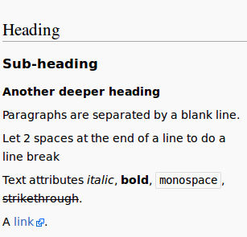
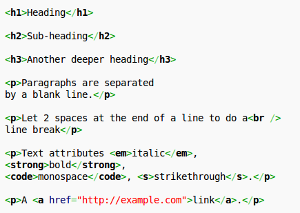
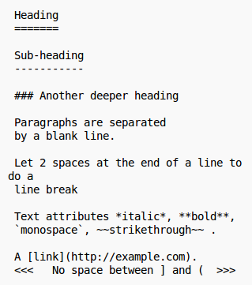
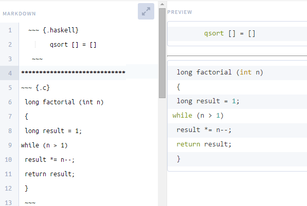
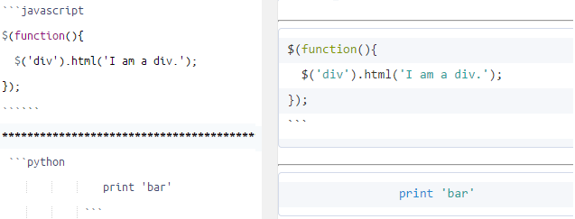
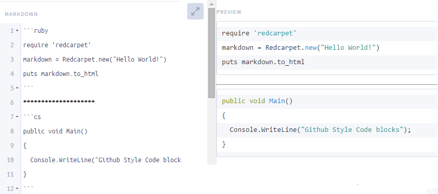
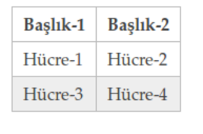
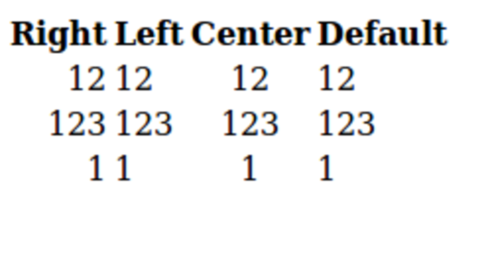
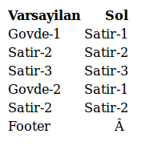

#   Markdown

.fx: first

Esra ERDEN `11060294`

Necmettin Olcay ÖZER `11060296`

Nisan 2015

---

##  Markdown 

Markdown metin işaretleme dilidir

-   Web ortamında kolayca okunup yazılabilen düz metinler oluşturmanızı sağlar

-   Belirli sözdizimi kuralları var

-   Zengin metin içeriği olmaya düz metinleri  html kullanmadan markdown ile hızlı bir şekilde yazılabilir

-   Genelde dökümanlarda,açıklama sayfalarında görülür(Github README dosyaları)

-   John Gruber tarafından 2004 yılında Perl dili ile yazılmıştır

##  Markdown

Aynı zamanda bir araç

-   HTML bir yayın formatı Markdown ise bir yazım formatı

-   Yayın için markdown ile yazdıklarımızı html haline getirmemiz gerekmekte

-   Yani web yazarları için düz metinlerin html karşılığını veren bir araç

##  Görüntü

Çıktı
:   Aşağıdaki sayfa görüntüsünü almak için  
    

##  Görüntü

HTML
:   html kullanarak aşağıdaki gibi yazarken     
    

##   Görüntü

Markdown
:   markdown ile daha kısa yazabiliriz    
    

##  Alternatifleri

-   Sözdizimi karşılaştırması

-   Uygulama özelliklerinin karşılaştırılması

[Buradan](http://en.wikipedia.org/wiki/Lightweight_markup_language) bakınız

#   Markdown Sözdizimi

##  Blok elementler

-   Paragraf ve boş satır bırakma

-   Başlıklar

-   Alıntılama

-   Listeler

-   Kod blokları

-   Yatay kurallar

##  Paragraf ve alt satıra geçme

-   Markdown yazılan düz metni doğrudan paragraf olarak algılıyor

-   `

` arasına yazmamıza gerek kalmıyor

-   Bir sonraki paragrafa geçmek için araya 1 satır boşluk bırakıyoruz

-   Alt satırdan devam etmek için metnin sonuna 2(space) boşluk bırakıyoruz.

-   ` ` görevi görüyor

##  Başlıklar

-   Setext stili başlıklar için  

    -  H1 başlık  
      
       `Başlık`  

       `======`  
    
    -  H2 başlık  
     
       `Başlık`  

       `------`

-   Atx stil için

-   `# H1 başlık`

-   `## H2 başlık`

-   `###### H6 başlık`

##  Alıntılama

-   Satır başında e-mail stili `>` karakteri kullanılır 
    
-   1 satır boşluk bırakıldığında alıntılamadan çıkar 

-   Aksi takdirde sonraki satırlar için `>` karakterine bakmadan alıntılamaya devam eder

-   İç içe alıntılama için `>>` kullanılır

-   İlk alıntılama bittikten sonra `>>` kullanılırak bir içerdeki alıntılamaya geçilir

-   `> Bu bir alıntıdır` 

-   `>> İçe içe alıntılama`

> Bu bir alıntıdır

>> İç içe alıntılama

##  Listeler

-   Sıralı ve sırasız liste gösterimleri desteklenir

-   Sırasız listeler için

    `+  Alıntılama`

    `*  Listeler`

    `-  Başlıklar`

-   Sırasız(numaralandırılmış) listeler için

    `1.  Alıntılama`

    `2.  Listeler`

-   Liste maddeleri seçilen liste gösterim işaretinden sonra en az 1 boşluk bırakılarak yazılmalıdır

## Kod Blokları

-   Kod blokları yazmak için satır başından 4 boşluk bırakılmalıdır
   
        def say
          puts "foo"
        end

-   Html karşılığı `<pre><code>**blok**</code></pre` şeklindedir 

##  Yatay Çizgiler

-   Sayfada yatay çizgi çizer

-   Html `
` işlevi

-   3 veya daha fazla `*` veya `-` karakteri kullanılır

-   `***` 

-   `* * *` 

-   `____`

##  Span Elementler

-   Linkler

-   Vurgulamalar

-   Kod 

-   Resimler
 
##  Linkler

-   Markdown ile satır içi ve referans linkler oluşturulabilir

-   Satır içi link `[bağlantı ismi](url "Başlık")` şeklindedir

-   Örnek olarak `[buraya](http://google.com "Başlık")` tıklayınız

Örnek olarak [buraya](http://google.com "Başlık") tıklayınız

-   Html karşılığı 

-   `
Örnek olarak <a href="http://google.com" title="Başlık">buraya</a> tıklayınız
`   

##  Linkler

-   Referans link `[bağlantı ismi][id]` şeklindedir

-   Örnek olarak `[buraya][1]` tıklayınız

-   id kısmını sayfanın sonlarına doğru tanımlayarak gerekli url bilgisi verilmelidir

-   `[1]: http://google.com "Başlık"`

Örnek olarak [buraya][1] tıklayınız

[1]: http://google.com

##  Linkler

-   Ayrıca otomatik link kullanılabilir

-   `< />` içerisine url yazılarak doğrudan link oluşturulabilir

-    `<http://google.com/>`

<http://google.com/>

##  Vurgulamalar

-   Metin içinde bir kelimeyi vurgulamak(dikkat çekmek) için kullanılır

-   Kelimenin başına ve sonuna `*` veya `_` karakterleri yazılır

-   `*yıldız*` veya daha güçlü(kalın) `**yıldız**`

-   bu şekilde görünür *yıldız* ve **yıldız**

-   `_alt tire_` veya daha güçlü `__alt tire__`

-   bu şekilde görünür  _alt tire_ ve __alt tire__

##  Kod

-   Metinlerin içine kod olduğu gibi yazılabilir

-   Html `<code>` elemeti 

-   Genellikle kısa kod ifadeleri için kullanılır

-   \` \` karakterleri arasına yazılır

Örnek 

-   Burada `
` etiketi kullanmaya gerek yok

-   Html karşılığı

-   `
burada <code>&lt;div&gt;</code> etiketi kullanmaya gerek yok
`

##  Resim ekleme

-   Link kullanımına benzer yapısı vardır.Satır içi veya refarans gösterim kullanılabilir

    -  Satır içi

       ``

    -  Referans 

       `![alt][id]`

       `[id]: /resim yolu/resim.uzantı`

##  \ Escape karakteri

-   Özel karakterlerin kendi anlamlarını koruyarak markdown sözdiziminin önüne geçmesini sağlar

-   `\` karakteri bu özel karakterlerin önüne gelerek anlamlarını korumasını sağlar

-   Örneğin `\**yıldız**\` yazılarak ** olduğu gibi korunabilir

-   \**yıldız\**

-   Bu karakterler aşağıda listelenmiştir

    -  `\  -   *   _`

    -  `{}  []  ()  #`

    -  `+  -  .  !`

##  Sözdiziminde karşılaşılan sorunlar

-   Alt satıra geçmek için satır veya paragraf bittikten sonra 2 veya daha fazla boşluk bırakılır

-   Kod bloğu liste içinde 1 satır boşluktan ve 8 boşluk girintilemeden sonra yazılır

-   Örnek gösterim  
        
        def say
          puts "foo"
        end

-   Kod blokları içerisinde ayrıştırılma yapılmaz karakterler olduğu gibi yazılır

##  Sözdiziminde karşılaşılan sorunlar

İç içe liste oluştururken girintileme çok önemli

-   İç içe liste

    -   Bir madde(4 boşluk)  

        -   Alt madde(8 boşluk)    
            Pragraf ...  
            devamı ...  
            
            -   Alt maddenin alt maddesi  
                Paragraf ...  
                devamı ...

       - Diğer alt madde  
         Paragraf ...  
         devamı ...  

   -   Diğer madde

##  Markdown Lehçeleri

-   Bir çok dil için markdown gerçeklemesi bulunmaktadır. Ör. Perl,Python,Ruby,Haskell

-   Dolayısıyla her gerçekleme içinde farklı sözdizimleri ve kurallar olması muhtemel

-   Bu farklılıklar ile lehçeler ortaya çıkmış oluyor

[Buradan](http://www.w3.org/community/markdown/wiki/MarkdownImplementations) çeşitli markdown lehçelerini görebilirsiniz

##  Markdown Lehçeleri

Lehçe              |  Dil     
---------------    |------------
Markdown.pl        | `Perl`
[Pandoc][2]        | `Haskell`
[Kramdown][3]      | `Ruby`
[Sundown][4]       | `C`
[Github Flavor][5] | `Node.js`
Blackfriday        | `Go`
Actuarius          | `Scala`
Misaka             | `Python`

[2]: http://pandoc.org/demo/example9/pandocs-markdown.html
[3]: http://kramdown.gettalong.org/syntax.html
[4]: https://github.com/vmg/sundown
[5]: https://help.github.com/articles/github-flavored-markdown

##  Sözdizimi renklendirmesi

-   Genelde ` ya da ~ karakteri kullanılır

-   Pandoc,Sundown için

##  Sözdizimi renklendirmesi

-   Nodejs,Python

##  Sözdizimi renklendirmesi

-   Ruby,C#

##  Markdown Tablo Oluşturma

-   Python Markdown için

        First Header  | Second Header
        ------------- | -------------
        Content Cell  | Content Cell
        Content Cell  | Content Cell
-   Çıktı

First Header  | Second Header
------------- | -------------
Content Cell  | Content Cell
Content Cell  | Content Cell

##  Markdown Tablo Oluşturma

-   Github Flavor için

        | Başlık-1 | Başlık-2 |
        |:--------:|:--------:|
        | Hücre-1  | Hücre-2  |
        | Hücre-3  | Hücre-4  |

-   Çıktı

##  Markdown Tablo Oluşturma

-   Pandoc için

          Right  Left   Center  Default
        -------  ----- -------- -------
             12   12     12       12
            123   123    123      123
              1   1      1        1    
-   Çıktı

##  Markdown Tablo Oluşturma

-   Kramdown için

        |-----------------+------------|
        | Varsayılan      | Sol        | 
        |-----------------|-----------:|
        | Gövde-1         | Satır-1    | 
        | Satır-2         | Satır-2    | 
        | Satır-3         | Satır-3    | 
        |-----------------+------------|
        | Gövde-2         | Satır-1    |    
        | Satır-2         | Satrı-2    |            
        |=================+============|
        | Footer          |            |                
        |-----------------+------------|

-   Çıktı

##  Markdown-PDF

Birkaç yolu var

-   md2pdf

        git clone git://github.com/joequery/md2pdf.git    
        cd md2pdf  
        sudo python setup.py install  
        md2pdf dosya.md

-   Pandoc ile

        sudo apt-get install latex-beamer  
        pandoc -t beamer -o pdf-dosya.pdf markdown-dosya.md  

##  Markdown-PDF

-   markdown-pdf

        npm install markdown-pdf  
        sudo npm install -g markdown-pdf  
        markdown-pdf  dosya.md
        
-   markdown2pdf

        phantomjs -v  
        sudo npm i markdown2pdf -g
        m2p markdown-dosya.md pdf-dosya.pdf

##  Uygulama

-   Redcarpet Gem'i ile basit markdown işleyiciler oluşturulabilir

[Buradan](https://gist.github.com/aed8558e31524680b651) bir örneğine bakabilirsiniz
