#   Danışmansız Öğrenme

.fx: first

Abdullah Yaprak `11060317`

Necmettin Olcay Özer `11060296`

Mart 2015

---

##  Danışmansız Öğrenme

-   Sistemin öğrenmesine yardımcı olacak bir öğretmen yok

-   Ağa sadece girdi değerleri verilir

-   Ağın ulaşması gereken hedef çıktılar verilmez.

-   Girişe verilen örnekten elde edilen çıkış bilgisine göre ağ sınıflandırma kurallarını kendi kendine geliştirir

##  Danışmansız Öğrenme

-   Sınıflandırma problemlerinde yaygın olarak kullanılır

-   Sistemin öğrenmesi bittikten sonra çıktıların ne anlama geldiğini gösteren etiketlendirmenin kullanıcı tarafından yapılması gerekmektedir

##  Danışmansız Öğrenme

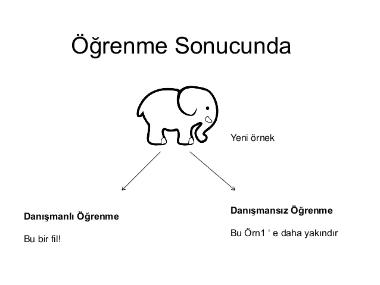

##  Danışmansız Öğrenme

-   Sistemin doğru çıkış hakkında bilgisi yok

-   Girişlere göre kendi kendini örnekler

-   Ağ bağlantı ağırlıklarını aynı desenler oluşturmak üzere ayarlar

##  Danışmansız Öğrenme

-   Bu öğrenmede gizli sinirler görev yaparlar

-   Dışardan herhangi bir yardım alınmaz

-   Kendini örgütlemek için bir yol bulmak zorundadır.

-   Yani ağ __yaparak__ öğrenmek zorundadır

##  Danışmansız Öğrenme

Danışmansız öğrenme ile

-   SOM(Self Organizing Map) 

-   ART(Adaptive Resonance Theory)

ağları geliştirilmiştir

##  Yarışmacı Öğrenme

-   Amaç n boyutlu bir vektörü bir vektörler setine haritalamaktır

-   Yani bir vektörün belirli bir sayıda vektör ile gösterimi amaçlanmaktadır

-   Öğrenme ile de girdi vektörünün hangi vektör seti tarafından temsil edildiğinin öğrenilmesi kastedilmektedir

-   Genel olarak sınıflandırma problemlerinde kullanılır

##  Yarişmacı Öğrenme

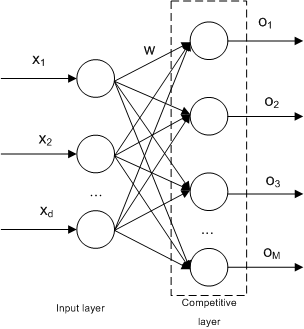

##  Yarışmacı Öğrenme

-   Eğitim sırasında girdilerin sınıflara ayrılması en yakın komşuluk kuralına göre gerçekleştirilir.

-  Girdi vektörü ile referans vektörleri arasındaki en kısa mesafe aranmaktadır

-  Girdi vektörü kendisine en yakın mesafede bulunan vektör grubuna aittir

-  Ağın ağırlıkları değiştirilerek girdileri doğru sınıflara ayıracak referans vektörler belirlenmektedir.

##  Yarişmacı Öğrenme

-  Girdi katmanı ile yarışma katmanı tam bağlantılıdır

-  Girdi katmanı ile yarışma katmanı arasındaki ağırlıklar değiştirilir

-  İstenilen duruma göre çıkışla ilgili işlemler yapılır

##  Yarışmacı Öğrenme

-  Öğrenme kuralı yarışma katmanındaki her proses elemanının bir biriyle yarışması ilkesine dayanır

-  Yarışma girdi vektörü ile ağırlık vektörleri(referans vektör) arasındaki öklid mesafesinin hesaplanmasına dayanır

-  Ağırlık vektörü girdi vektörüne en yakın olan proses elemanı yarışmayı yazanır

##  Yarışmacı Öğrenme

-  i. proses elemanının mesafesi aşağıdaki gibi hesaplanır

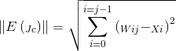

-  Girdi vektörü X

-  Referans (Ağırlık) vektörü A

-  Aralarındaki mesafe d

##  Yarişmacı Öğrenme

-  Bütün mesafeler hesaplandıktan sonra en yakın olan kazanandır

-  `Kazanan düğüme bağlı girdi elemanlarının ağırlıkları değiştirilir`
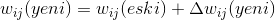

-  Ağırlıklar girdi vektörüne biraz daha yaklaştırılır

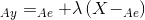

-  Veya uzaklaştırılır

   
##  Özörgütlemeli Harita Ağı

-   SOM(Self-organizing map)

-   Kohonen tarafından geliştirilmiştir

-   Genellikle sınıflandırma yapmak için kullanılır

-  `Girdi vektörlerini ve girdi vektörlerinin dağılımını` öğrenebilme yetenekleri yüksektir

##  Özörgütlemeli Harita Ağı

-   Yarışmacı öğrenimle eğitilir 

-   Girdi ve çıktı olmak üzer 2 katmandan oluşur

-   Çıktı katmanı 2 boyutlu düzlemi göstermektedir

-   Proses elemanları bu düzlem üzerine dağılmış vektörleri gösterirler

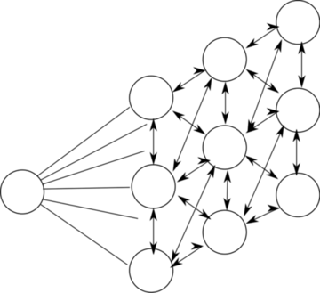
##  Özörgütlemeli Hatita Ağı

-   SOM ağları yarışmayı kazanma ve kazanan elemanın 1 diğer elamanların 0 değerini alması ilkesine dayanır.

-   Bir girdi verildiğinde çıktı uzayında yarışmayı kazanan ve onun etrafındaki komşuların ağırlıkları değiştirilir

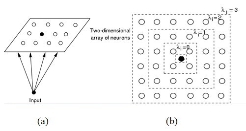

##  Özörgütlemeli Harita Ağı

Algoritma
:   Adım 1

    -  Giriş sinir matrisi

    -  Giriş_x

    -  Giriş_y

    - I = Giriş_x * Giriş_y

##  Özörgütlemeli Harita Ağı

Algoritma
:   Adım 2

    -   Yarişmacı katman matrisi
    
    -   Çıkış_x

    -   Çıkış_y

    -   J = Çıkış_x * Çıkış_y
    
##  Özörgütlemeli Harita Ağı

Algoritma
:   Adım 3

    -   Giriş katmanındaki sinirler ile yarışmacı katman arasındaki bağlantıların ağırlıkları rastgele seçilir

##  Özörgütlemeli Harita Ağı

Algoritma
:   Adım 4

    -   Yarışmacı katmandaki kazanan sinir hesaplanır
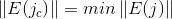
----

##  Özörgütlemeli Harita Ağı

Algoritma
:   Adım 5

    -   Bütün j ve i değerleri için ağırlıklar güncellenir

----
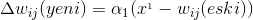

##  Özörgütlemeli Harita Ağı

Algoritma
:   Adım 6

    -   Öğrenme katsayısı değiştirilir
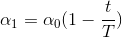

##  Özörgütlemeli Harita Ağı

Algoritma
:   Adım 7

    -   Belirtilen zamanda topolojik çap azaltılır
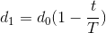

#   Özörgütlemeli harita örneği

##  Özörgütlemeli Harita Ağı
    
-   Örnek olarak resimdeki ağı ele alalım

-   j1, j2 olarak 2 kümeye göre haritalama yapılmalıdır

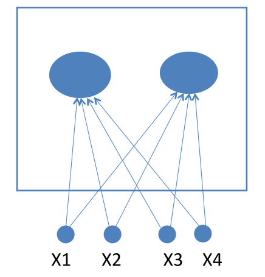

##  Özörgütlemeli Harita Ağı

Eğitim aşaması
:   Adım 1

    -   Eğitime başlanır

    -   Eğitim için rastgele seçilen ağırlıklar
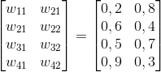

    -   ve eğitim için elimizde 4 tane vektör olsun 

    -   (1,1,0,0),(0,0,0,1)

    -   (1,0,0,0),(0,0,1,1)

    -   Örneklenecek küme sayısı 2 olduğundan j = 2

    -   İlk öğrenme katsayısı a(0) = 0.6 olarak seçilsin
    
    -   İlk çap R = 0

##  Özörgütlemeli Harita Ağı

Eğitim Aşaması
:   Adım 2

    -   Birinci vektör (1,1,0,0) için algoritmalar kısmındaki Adım(3-5) uygulanır 

##  Özörgütlemeli Harita Ağı

Eğitim Aşaması
:   Adım 3

    -   Bu adımda mesafe hesaplanır
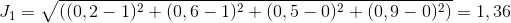
----
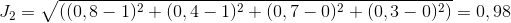

##  Özörgütlemeli Harita Ağı

Eğitim Aşaması
:   Adım 4

    -   Giriş vektörü çıkış düğüm değerine yakın olduğundan J2 kazanan sinir olacaktır
    
    -   Dolayısıyla bu  düğümün ağırlıkları güncellenecektir
    
##  Özörgütlemeli Harita Ağı

Eğitim Aşaması
:   Adım 5

    -   Kazanan düğümün ağırlıkları güncellenir

----
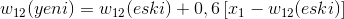
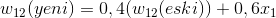
----
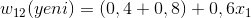
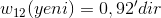

    -   Yeni ağırlık matrisi
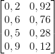

##  Özörgütlemeli Harita Ağı

Eğitim Aşaması
:   Adım 2

    -   İkinci vektör (0,0,0,1) için algoritmalar kısmındaki Adım(3-5) uygulanır 

##  Özörgütlemeli Harita Ağı

Eğitim Aşaması
:   Adım 3

    -   Bu adımda mesafe hesaplanır
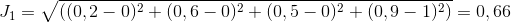
----
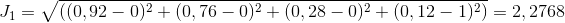

##  Özörgütlemeli Harita Ağı

Eğitim Aşaması
:   Adım 4

    -   Giriş vektörü çıkış düğüm değerine yakın olduğundan J1 kazanan sinir olacaktır

##  Özörgütlemeli Harita Ağı

Eğitim Aşaması
:   Adım 5

    -   Kazanan düğümün ağırlıkları güncellenir

    -   Yeni ağırlık matrisi
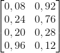

##  Özörgütlemeli Harita Ağı

Eğitim Aşaması
:   Adım 2

    -   Üçüncü vektör (1,0,0,0) için algoritmalar kısmındaki Adım(3-5) uygulanır 

##  Özörgütlemeli Harita Ağı

Eğitim Aşaması
:   Adım 3

    -   Bu adımda mesafe hesaplanır
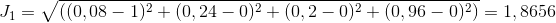
----
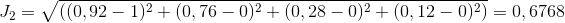

##  Özörgütlemeli Harita Ağı

Eğitim Aşaması
:   Adım 4

    -   Giriş vektörü çıkış düğüm değerine yakın olduğundan J2 kazanan sinir olacaktır

##  Özörgütlemeli Harita Ağı

Eğitim Aşaması
:   Adım 5

    -   Kazanan düğümün ağırlıkları güncellenir

    -   Yeni ağırlık matrisi
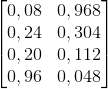

##  Özörgütlemeli Harita Ağı

Eğitim Aşaması
:   Adım 2

    -   Dördüncü vektör (0,0,1,1) için algoritmalar kısmındaki Adım(3-5) uygulanır 

##  Özörgütlemeli Harita Ağı

Eğitim Aşaması
:   Adım 3

    -   Bu adımda mesafe hesaplanır
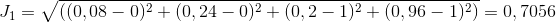
----
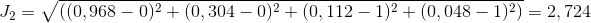

##  Özörgütlemeli Harita Ağı

Eğitim Aşaması
:   Adım 4

    -   Giriş vektörü çıkış düğüm değerine yakın olduğundan J1 kazanan sinir olacaktır

##  Özörgütlemeli Harita Ağı

Eğitim Aşaması
:   Adım 5

    -   Kazanan düğümün ağırlıkları güncellenir

    -   Yeni ağırlık matrisi
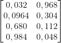

##  Özörgütlemeli Harita Ağı

Eğitim Aşaması
:   Adım 6

    -   Öğrenme kaysayısı azaltılır

    -   a = 0.5 * 0.6 

    -   Ağırlıklar güncellenir ikinci turdaki ağırlık matrisi bulunur
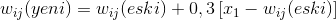
----
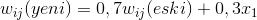
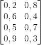

    -   Öğrenme katsayısını 0.01 e kadar düşmesi için yapılan ayarlamalar 100 işlem sonunda sonuç verir 

##  Özörgütlemeli Harita Ağı

Eğitim Aşaması
:   Adım 7

    -   İşlem 0: Ağırlık Matrisi

    
    -   İşlem 1: Ağırlık matrisi
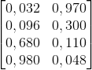

    -   İşlem 10: Ağırlık matrisi
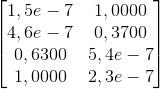

## Özörgütlemeli Harita Ağı

Eğitim aşaması
:   Adım 7

    -   İşlem 100: Ağırlık matrisi
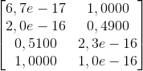
    -   Sonuç
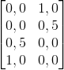

##  Özörgütlemeli Harita Ağı

Eğitim Aşaması
:   Adım 8

    -   İşlem zamanı bir artırılır

    -   t = t + 1

    -   t = T oluncaya kadar Adım 5-8 tekrarlanır

##  Özörgütlemeli Harita Ağı

Eğitim Aşaması
:   Adım 9

    -   Sonraki örnek için Adım 2-9 tekrar edilir

##  Özörgütlemeli Harita Ağı

Çağırma Aşaması
:   Çağırma

    -   Bu aşama yapay sinir ağının hangi vektörünün hangi kümeye dahil olduğunun sınandığı aşamadır
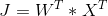
----
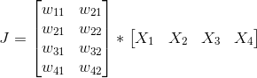

##  Özörgütlemeli Harita Ağı

Çağırma Aşaması
:   Çağırma

    -   Bu aşama yapay sinir ağının hangi vektörünün hangi kümeye dahil olduğunun sınandığı aşamadır
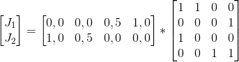

##  Özörgütlemeli Harita Ağı

Çağırma Aşaması
:   Çağırma

    -    Vektör 1

    -    Vektör 2
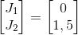

    -    Vektör 3
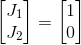

    -    Vektör 4
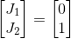

